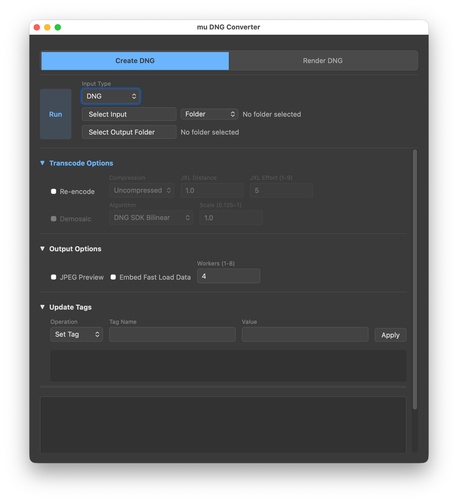

# mu DNG Converter

[](LICENSE)
[](https://github.com/mu-files/mu-image/releases/latest)

A cross-platform desktop application for batch image conversion built on [muimg](../muimg/README.md).

[Download latest release](https://github.com/mu-files/mu-image/releases/latest)

## Create DNG

<table><tr>
<td></td>
<td></td>
</tr></table>

Process and transcode DNG files or convert FITS files to DNG with full control:
- Dual input support (DNG or FITS files)
- Compression options (uncompressed, JXL lossless, JXL lossy)
- Optional demosaic with algorithm selection
- Resolution scaling (0.125–1.0)
- Metadata operations (set/strip tags, time adjustments)
- JPEG preview and fast-load pyramid embedding
- Multi-threaded batch processing (1–8 workers)

> **Input Type**  
> Switch between DNG and FITS input. FITS is a pure RAW data format where the rendering settings (auto exposure, white balance, tone curve) are not in the file so are settable in the UI. Both CFA and mono/grayscale FITS input are accepted and UINT16, UINT32, and FLOAT32 data types are supported.

> **Auto Exposure**  
> FITS files from astronomical cameras often have no embedded exposure hint, causing RAW editors like Photoshop to render them nearly black. When enabled, Auto Exposure analyses the image histogram to estimate a black level (1st percentile) and an exposure shift (targeting ~6% brightness), so the image opens at a reasonable starting point. The `PEDESTAL` FITS header is used as the black level when present.

> **AVM XMP Metadata**  
> Astronomy Visualization Metadata (AVM) is a standard for embedding sky coordinates, instrument details, and observation data in image files. When FITS headers contain WCS coordinates (`CRVAL`, `CDELT`, etc.), object names, filter, or telescope information, these are mapped to AVM XMP tags in the output DNG — transferring these tags to downstream applications.

> **Transcode/Encode Options**  
> Re-encode DNGs with different compression (JXL lossless/lossy), optionally demosaic to linear RGB, and scale output resolution. Useful for reducing file size or preparing DNGs for specific workflows.

> **Update Tags**  
> Batch modify TIFF/DNG metadata tags. Set custom tags, strip unwanted tags, shift timestamps, or set timezone. Operations are applied to all output files.

## Render DNG

<table><tr>
<td></td>
<td></td>
</tr></table>

Convert DNG files to TIFF, JPEG, or MP4 video with some rendering control:
- White balance (presets or custom temperature/tint)
- Exposure adjustment
- Output bit depth (8-bit or 16-bit)
- Resolution scale (0.125–1.0)
- Video encoding (codec, resolution, frame rate, CRF)
- Multi-threaded batch processing (1–8 workers)

> **Output Mode**  
> The mode selector at the top controls the output format. In addition to TIFF and JPEG, selecting **Video** produces an MP4 from a DNG sequence — useful for timelapse or allsky footage. Video mode has its own codec, resolution, frame rate, and CRF controls.

> **Use XMP**  
> When enabled (default), white balance, exposure, crop, and tone curve are read from the DNG's embedded XMP metadata — exactly as set in your RAW editor. Disable this to apply your own white balance and exposure overrides instead.

> **Scale**  
> Renders output at a fraction of full resolution (e.g. `0.5` = half size). Useful for generating quick previews or producing smaller deliverables without changing the source files. In video mode scale is set by the resolution control.

## FITS → DNG CLI

In addition to the GUI, a command-line tool `fits2dng` is available for scripting and server-side use. Only colour CFA FITS files (those with a `BAYERPAT` header) are supported; mono images are skipped.

```bash
# Single file
fits2dng input.FIT

# Batch convert a folder
fits2dng input_folder/ -o output_folder/

# With JXL lossless compression and embedded preview
fits2dng input.FIT --compression jxl_lossless --preview

# Print FITS header info (no conversion)
fits2dng input.FIT --info
```

### CLI Options

```
input                   Input FITS file or folder (.fit / .fits)
-o, --output            Output DNG path or output folder
--compression           uncompressed (default), jpeg_lossless, jxl_lossless, jxl_lossy
--workers               Number of compression workers (default: 4)
--preview               Embed JPEG preview
--fast-load             Embed fast-load pyramid levels
--no-auto-exposure      Disable automatic BaselineExposure calculation
--ev EV                 Manual exposure shift in EV (with --no-auto-exposure)
--no-tone-curve         Disable default S-curve tone curve
--wb-temperature K      White balance color temperature in Kelvin
--wb-tint TINT          White balance tint (default: 0)
--info                  Print FITS header info and exit
-v                      INFO logging (pipeline stats, timing); -vv for DEBUG
```

## Getting Started

### Desktop (macOS, Windows, Linux)

Download a pre-built binary from the [Releases](https://github.com/mu-files/mu-image/releases) page. No Python installation required.

> **macOS note:** The app is signed and notarized. On first launch, macOS will show a security prompt; click **Open** to proceed. Subsequent launches open normally.

> **Windows note:** Download and run `mu-dng-converter-windows-setup.exe`. The installer is digitally signed by mu-files LLC. Windows SmartScreen may initially warn that the app is unrecognized while our certificate builds reputation — click **More info** then **Run anyway** to proceed. The installer adds a Start Menu shortcut and an optional desktop icon.

### Raspberry Pi

Install directly from GitHub using pip (Python 3.12+ required). Raspberry Pi OS requires a virtual environment:

```bash
python3 -m venv ~/mu-dng-converter-venv
~/mu-dng-converter-venv/bin/pip install "mu-dng-converter @ git+https://github.com/mu-files/mu-image.git#subdirectory=mu-dng-converter"
~/mu-dng-converter-venv/bin/mu-dng-converter
```

### Developers

Clone the repository and install in editable mode (Python 3.12+ required):

```bash
git clone https://github.com/mu-files/mu-image.git
cd mu-image/mu-dng-converter
pip install -e .
mu-dng-converter
```
