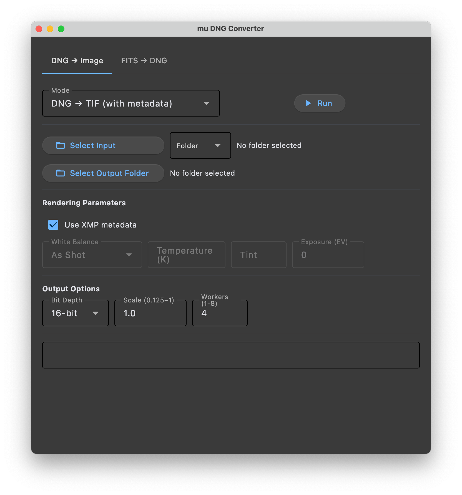
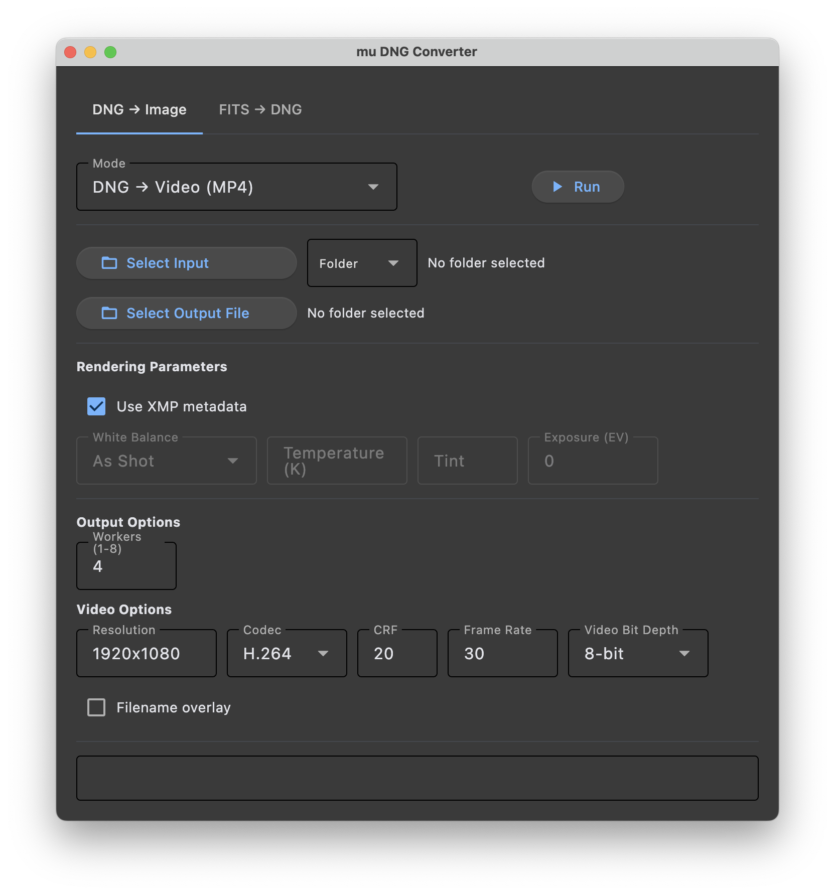
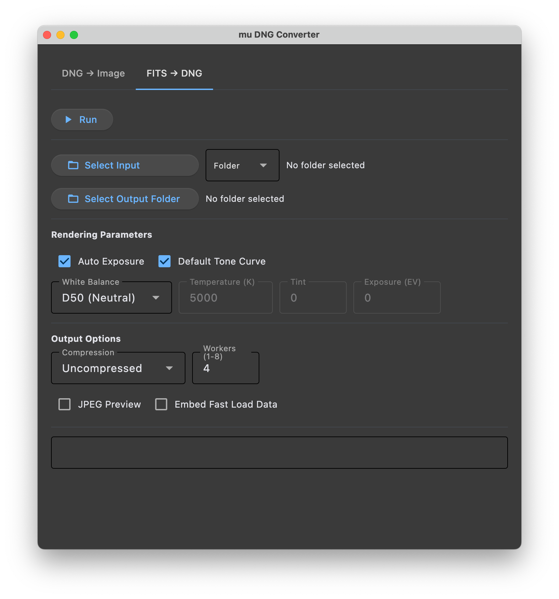

# mu DNG Converter

[](LICENSE)
[](https://github.com/mu-files/mu-image/releases/latest)

A cross-platform desktop application for batch image conversion built on [muimg](../muimg/README.md) and [Flet](https://flet.dev).

[Download latest release](https://github.com/mu-files/mu-image/releases/latest)

## DNG → Image

<table><tr>
<td></td>
<td></td>
</tr></table>

Convert DNG files to TIFF or JPEG with full rendering control:
- White balance (presets or custom temperature/tint)
- Exposure adjustment
- Output bit depth (8-bit or 16-bit)
- Resolution scale (0.125–1.0)
- Multi-threaded batch processing (1–8 workers)

> **Output Mode**  
> The mode selector at the top controls the output format. In addition to TIFF, JXL, and JPEG, selecting **Video** produces an MP4 from a DNG sequence — useful for timelapse or allsky footage. Video mode has its own codec, resolution, frame rate, and CRF controls.

> **Use XMP**  
> When enabled (default), white balance, exposure, and tone curve are read from the DNG's embedded XMP metadata — exactly as set in your RAW editor. Disable this to apply your own white balance and exposure overrides instead.

> **Scale**  
> Renders output at a fraction of full resolution (e.g. `0.5` = half size). Useful for generating quick previews or producing smaller deliverables without changing the source files.

## FITS → DNG



Convert astronomical FITS (with bayer patterns) to DNG for use in Photoshop and other RAW editors:
- Auto exposure (histogram-based EV shift and black level estimation)
- AVM XMP metadata mapping from FITS headers
- Color temperature selection
- Color space configuration
- JPEG preview and fast-load pyramid embedding
- Multi-threaded batch processing (1–8 workers)

> **CFA (colour) images only**  
> Only colour camera FITS files with a `BAYERPAT` header (e.g. RGGB, BGGR) are supported. Mono/grayscale images (narrowband Ha, L, OIII, etc.) are currently not supported and skipped.

> **Auto Exposure**  
> FITS files from astronomical cameras often have no embedded exposure hint, causing RAW editors like Photoshop to render them nearly black. When enabled, Auto Exposure analyses the image histogram to estimate a black level (1st percentile) and an exposure shift (targeting ~6% brightness), so the image opens at a reasonable starting point. The `PEDESTAL` FITS header is used as the black level when present.

> **AVM XMP Metadata**  
> Astronomy Visualization Metadata (AVM) is a standard for embedding sky coordinates, instrument details, and observation data in image files. When FITS headers contain WCS coordinates (`CRVAL`, `CDELT`, etc.), object names, filter, or telescope information, these are mapped to AVM XMP tags in the output DNG — transferring these tags to downstream applications.

## FITS → DNG CLI

In addition to the GUI, a command-line tool `fits2dng` is available for scripting and server-side use. Only colour CFA FITS files (those with a `BAYERPAT` header) are supported; mono images are skipped.

```bash
# Single file
fits2dng input.FIT

# Batch convert a folder
fits2dng input_folder/ -o output_folder/

# With JXL lossless compression and embedded preview
fits2dng input.FIT --compression jxl_lossless --preview

# Print FITS header info (no conversion)
fits2dng input.FIT --info
```

### CLI Options

```
input                   Input FITS file or folder (.fit / .fits)
-o, --output            Output DNG path or output folder
--compression           uncompressed (default), jpeg_lossless, jxl_lossless, jxl_lossy
--workers               Number of compression workers (default: 4)
--preview               Embed JPEG preview
--fast-load             Embed fast-load pyramid levels
--no-auto-exposure      Disable automatic BaselineExposure calculation
--ev EV                 Manual exposure shift in EV (with --no-auto-exposure)
--no-tone-curve         Disable default S-curve tone curve
--wb-temperature K      White balance color temperature in Kelvin
--wb-tint TINT          White balance tint (default: 0)
--info                  Print FITS header info and exit
-v                      INFO logging (pipeline stats, timing); -vv for DEBUG
```

## Getting Started

### Desktop (macOS, Windows, Linux)

Download a pre-built binary from the [Releases](https://github.com/mu-files/mu-image/releases) page. No Python installation required.

> **macOS note:** The app is not yet notarized. On first launch macOS may show a message saying the app cannot be opened. To allow it:
> 1. Try to open the app (double-click) — macOS will block it
> 2. Open **System Settings → Privacy & Security**
> 3. Scroll down to the Security section — you will see a message about mu-dng-converter
> 4. Click **Open Anyway**
> 5. The app will open and you won't be prompted again

> **Windows note:** Download and run `mu-dng-converter-windows-setup.exe`. Windows SmartScreen may warn that the app is unrecognized — click **More info** then **Run anyway** to proceed. The installer adds a Start Menu shortcut and an optional desktop icon.

### Raspberry Pi

Install directly from GitHub using pip (Python 3.12+ required). Raspberry Pi OS requires a virtual environment:

```bash
python3 -m venv ~/mu-dng-converter-venv
~/mu-dng-converter-venv/bin/pip install "mu-dng-converter @ git+https://github.com/mu-files/mu-image.git#subdirectory=mu-dng-converter"
~/mu-dng-converter-venv/bin/mu-dng-converter
```

> **First launch:** Flet downloads its desktop runtime on first run — this is a one-time operation and may take a minute.

### Developers

Clone the repository and install in editable mode (Python 3.12+ required):

```bash
git clone https://github.com/mu-files/mu-image.git
cd mu-image/mu-dng-converter
pip install -e .
mu-dng-converter
```
