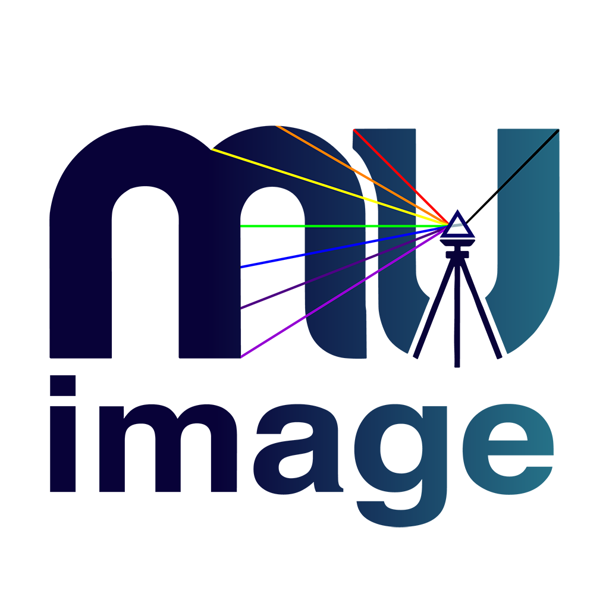

<p align="center" style="background-color: white; padding: 20px 0; margin: 0 0 30px 0;">
  
</p>

# muimg

Python library for reading, writing, and rendering Adobe DNG (Digital Negative) raw image files. Provides both a comprehensive Python API and command-line tools for DNG manipulation, rendering, metadata handling, and multi-threaded batch processing. Performance-critical operations are implemented in C/C++ extensions, but this initial (May 1, 2006) release prioritizes rendering correctness over speed optimization.

## Key Features

- **DNG Read/Write**: Full support for reading, writing, and modifying Adobe DNG (Digital Negative) files
- **RAW Rendering Pipeline**: Complete implementation of DNG rendering pipeline (linearization, demosaicing, opcodes, color correction, tone curves). On MacOS can opt between built-in renderer and coreimage renderer.
- **Multiple Demosaicing Algorithms**: DNGSDK_BILINEAR, VNG, RCD (optional), OPENCV_EA
- **XMP Support**: Renderer supports Temperature, Tint, Exposure, Curves, and radial distortion from XMP metadata
- **Metadata Handling**: User-friendly TIFF/EXIF/XMP tag handling with automatic type conversion
- **Compression**: Uncompressed, JPEG, JPEG XL support
- **CLI Tools**: Comprehensive command-line interface for DNG operations
- **Batch Processing**: Multi-threaded batch conversion and video encoding

## Installation

### As a Dependency

To add muimg to your project, add this to your `pyproject.toml`:

```toml
[project]
dependencies = [
    "muimg @ git+https://github.com/mu-files/mu-image.git#subdirectory=muimg",
]
```

### For Local Development or CLI Usage

Clone the repository and install the package in editable mode:

```bash
git clone https://github.com/mu-files/mu-image.git
cd mu-image/muimg
pip install -e .
```

This gives you access to the `muimg` CLI command and allows you to modify the source code.

### Optional: Core Image (macOS)

For macOS users, installing the Core Image dependency enables a second rendering engine that will be available at runtime alongside the built-in renderer. To add Core Image support:

```bash
pip install -e ".[coreimage]"
```

Or in `pyproject.toml`:

```toml
dependencies = [
    "muimg[coreimage] @ git+https://github.com/mu-files/mu-image.git#subdirectory=muimg",
]
```

### Build Requirements

**Note**: muimg includes C/C++ extensions for performance-critical pixel operations. macOS and Linux have built-in C compilers and require no additional downloads. Windows users need [Microsoft C++ Build Tools](https://visualstudio.microsoft.com/visual-cpp-build-tools/) (>1 GB download) to compile the extensions during pip install.

## API Overview

### Core Classes

**`DngFile`**: Subclass of `TiffFile` for reading DNG files. Provides access to IFDs (Image File Directories), metadata, and raw image data.

**`DngPage`**: Subclass of `TiffPage` representing a single IFD within a DNG file. Can be a raw CFA page, LinearRaw RGB page, or preview/thumbnail. Provides methods to extract raw data at various pipeline stages and render to display-referred RGB.

**`MetadataTags`**: Container for TIFF/EXIF/DNG tags with type-safe tag handling.

### Reading DNGs

**Opening and navigating**: `DngFile(path)` opens a DNG file. Use `ifd0` property to access IFD0, `get_main_page()` to get the primary raw image, or `get_flattened_pages()` to access all IFDs including SubIFDs.

**Extracting raw data**: `DngPage.get_cfa()` extracts CFA (Color Filter Array) data at various pipeline stages (raw, linearized, post-opcodes). `DngPage.get_linear_raw()` extracts LinearRaw RGB data.

**Rendering to RGB**: `DngPage.render()` applies the full DNG rendering pipeline (demosaicing, opcodes, color correction, tone curves, etc.) to produce display-referred RGB. The `scale` parameter allows for fast preview renders at reduced resolution. `decode_dng()` is a convenience function that handles file opening and rendering in one call.

**Metadata access**: `DngPage.get_tag(name)` retrieves TIFF/DNG tags with automatic type conversion (e.g., `get_tag("ColorMatrix1")` returns a 3×3 NumPy array). 

### Writing DNGs

**`write_dng()`**: Most general function to create a DNG file. Takes an IFD0 spec and optional list of SubIFD specs (each can be `IfdPageSpec` or `IfdDataSpec`). Each spec describes the page data and how to encode it.

**`write_dng_from_page()`**: Create a DNG from an existing `DngPage` or `IfdPageSpec`. Supports transformations (scaling, demosaicing), compression transcoding (e.g., uncompressed to JXL), preview/pyramid generation, and tag manipulation.

**`write_dng_from_array()`**: Create a DNG from an `IfdDataSpec` containing a NumPy raw pixel data array and metadata. Supports preview and pyramid generation.

### Batch Processing

**Pipeline control**: `ProcessingPipeline` class provides fine-grained control over batch processing with customizable producer/consumer/writer stages that decouple file I/O operations from pixel processing (e.g., decouple reading DngFile from disk and rendering it).

**Image sequences**: `ImageSequencePipeline` - a `ProcessingPipeline` for processing sequences of image files and saving the results (.tiff/.jpg) to an output folder.

**Video encoding**: `VideoEncodePipeline` - a `ProcessingPipeline` for encoding image sequences to video files with configurable codecs, resolution, and frame rates, and saving the result to a video file (.mp4).

**Parallelism**: Control parallelism with `--num-workers` flag in CLI or `num_workers` parameter in API. Default is 4 workers. Adjust based on CPU cores and memory availability.

### Metadata

**Tag management**: `MetadataTags.add_tag()` adds TIFF/EXIF tags with automatic type handling. `DngPage.get_page_tags()` returns a `MetadataTags` object with metadata for that page.

**Type registry**: `TIFF_TAG_TYPE_REGISTRY` provides metadata about all supported TIFF/DNG tags including data types, valid IFDs, and enum mappings.

## CLI Commands

The `muimg` command provides comprehensive DNG operations:

### Image Format Conversion

```bash
# Convert any image format to another
muimg convert-image input.tif output.jpg
```

### DNG Metadata

Display and filter DNG metadata:

```bash
# Show all metadata for all IFDs
muimg dng metadata input.dng

# Show specific IFD
muimg dng metadata input.dng --ifd 0

# Filter tags by pattern
muimg dng metadata input.dng --tag "Color.*" --tag "Exposure"

# Exclude tags
muimg dng metadata input.dng --exclude-tag "XMP"

# Summary only
muimg dng metadata input.dng --summary
```

### DNG Raw Stage Extraction

Extract raw data at specific pipeline stages:

```bash
# Extract un-processed raw data
muimg dng raw-stage input.dng output.tif raw

# Extract after OpcodeList2
muimg dng raw-stage input.dng output.tif linearized-plus-ops

# Extract demosaiced camera RGB
muimg dng raw-stage input.dng output.tif camera-rgb --demosaic VNG

# Extract from specific IFD
muimg dng raw-stage input.dng output.tif linearized --ifd subifd2
```

### DNG Copy and Transform

Create new a new DNG from source DNG with optional transformations:

```bash
# Create a new dng file with main page transcoded to JXL
muimg dng copy input.dng output.dng --jxl-distance 0.5

# Scale and demosaic
muimg dng copy input.dng output.dng --scale 0.5 --demosaic

# Generate preview
muimg dng copy input.dng output.dng --preview --preview-max-dim 1024

# Strip tags
muimg dng copy input.dng output.dng --strip-tag OpcodeList2,OpcodeList3

# Add/override tags
muimg dng copy input.dng output.dng --tag "Artist=John Doe" --tag "Copyright=2026"

# Generate raw "preview" pyramid levels
muimg dng copy input.dng output.dng --pyramid-levels 3
```

### DNG Rendering

Convert DNG to display image with adjustments:

```bash
# Basic conversion
muimg dng convert input.dng output.jpg

# With white balance and exposure
muimg dng convert input.dng output.tif --temperature 5500 --tint 10 --exposure 0.5

# 16-bit output
muimg dng convert input.dng output.tif --bit-depth 16

# Use Core Image on macOS
muimg dng convert input.dng output.jpg --use-coreimage

# Convert specific IFD
muimg dng convert input.dng output.jpg --ifd subifd1
```

### Batch DNG Conversion

Process multiple DNGs in parallel:

```bash
# Convert folder of DNGs to TIFF
muimg dng batch-convert /path/to/dngs/ /path/to/output/ --format tif

# Control parallelism (set to 8 here, default is 4 workers)
muimg dng batch-convert /path/to/dngs/ /path/to/output/ --format tif --num-workers 8

# With fixed rendering parameters for each image
muimg dng batch-convert /path/to/dngs/ /path/to/output/ \
  --format jxl --temperature 5500 --exposure 0.5

# From CSV with per-file settings
# CSV format: filename,Temperature,Tint,Exposure2012,orientation
muimg dng batch-convert settings.csv /path/to/output/ --format tif

# Scaled output (uses efficient scaling rendering path)
muimg dng batch-convert /path/to/dngs/ /path/to/output/ --scale 0.5
```

### Batch DNG to Video

Create video from DNG sequence:

```bash
# Basic video creation
muimg dng batch-to-video /path/to/dngs/ output.mp4

# With rendering and encoding options
muimg dng batch-to-video /path/to/dngs/ output.mp4 \
  --resolution 1920x1080 --codec hevc --crf 20 --bit-depth 10 \
  --temperature 5500 --exposure 0.5 --frame-rate 30

# Timelapse (1 frame every 2 seconds)
muimg dng batch-to-video /path/to/dngs/ timelapse.mp4 --frame-rate 0.5

# With filename overlay
muimg dng batch-to-video /path/to/dngs/ output.mp4 --overlay-txt

# From CSV with per-file settings
muimg dng batch-to-video settings.csv output.mp4 --resolution 1920x1080
```

### Google Photos Integration

Upload images to Google Photos:

```bash
# Authenticate
muimg google-photos auth --credentials credentials.json

# Upload image
muimg google-photos upload image.jpg --album "My Album"

# List albums
muimg google-photos list-albums
```

## Examples

### make_test_dng.py

Creates size-constrained test DNG files by iteratively scaling down the image resolution until it fits within a target size. All test files were generated using this code.

```bash
python examples/make_test_dng.py input.dng output.dng --target-size 1048576
python examples/make_test_dng.py input.dng output.dng --target-size 1048576 --generate-preview
```

Features:
- Iterative scaling by powers of 2 until target size is met
- Demosaics to LINEAR_RAW in order to scale image
- Optional JXL compression

## Tests

The test suite covers DNG reading, writing, rendering, metadata handling, and CLI operations.

### Running Tests

```bash
cd /path/to/mu-image/muimg
venv/bin/pytest tests/
```

Run specific test file:
```bash
venv/bin/pytest tests/test_dng_render.py -v
```

Run with detailed logging:
```bash
venv/bin/pytest tests/test_cli.py -v -s --log-cli-level=INFO
```

### Test Categories

**Note**: Many tests validate results against Adobe's `dng_validate` tool from the DNG SDK. To use this validation:
1. Download DNG SDK from: https://helpx.adobe.com/camera-raw/digital-negative.html
2. Build the `dng_validate` tool (see SDK documentation)
3. Place the binary at the path specified in `tests/conftest.py` or update `DNG_VALIDATE_PATH`

Tests will continue using muimg's built-in validator if `dng_validate` is not available.

**Note**: Test DNG files (~80 MB) are stored in a separate repository (`mu-files/mu-image-testdata`) and are automatically downloaded on the first test run.

**DNG Rendering** (`test_dng_render.py`): Tests the full rendering pipeline including linearization, demosaicing, color correction, tone curves, and output color space conversion for a variety of real camera DNG files (scaled to download-friendly resolution) and compares results against `dng_validate`.

**Metadata Handling** (`test_metadata_*.py`): Tests TIFF tag reading/writing, endianness handling, XMP parsing, and Core Graphics metadata extraction on macOS.

**Write Operations** (`test_write_dng*.py`): Tests DNG creation from arrays, page copying, compression options, and tag manipulation.

**Roundtrip Tests** (`test_*_roundtrip.py`): Tests that read-modify-write operations preserve data correctly (color temperature, SubIFD structure).

**CLI Commands** (`test_cli.py`): Tests command-line interface functionality.

**Preview and Pyramid** (`test_preview_rendering.py`, `test_pyramid_subifd.py`): Tests thumbnail/preview generation and pyramid level creation.

**Demosaicing** (`test_demosaic.py`): Tests various demosaicing algorithms.

## Known Issues

### Not Implemented

The following DNG features are not yet implemented:

- **Triple-illuminant**: Support for 3 calibration illuminants (ColorMatrix3, CalibrationIlluminant3)
- **RGBTables**: DNG 1.6+ per-channel 1D LUTs
- **ReductionMatrix**: Support for cameras with >3 color channels
- **SemanticMasks**: DNG 1.6+ depth maps and segmentation masks
- **HDR/Overrange**: ProfileDynamicRange and extended dynamic range support

See [docs/dng_render_pipeline.md](docs/dng_render_pipeline.md) for detailed implementation status of each pipeline stage.

### Performance Notes

**Demosaicing Algorithms**: muimg includes several demosaicing algorithms with different quality/speed tradeoffs:
- **DNGSDK_BILINEAR**: Good quality, fast (default for most operations)
- **VNG**: High quality, slower
- **OPENCV_EA**: Fastest, lower quality
- **RCD** (optional, GPL-licensed): High quality, slower

The RCD (Ratio Corrected Demosaicing) algorithm is disabled by default because it's licensed under **GPL v3**, which is separate from muimg's PolyForm Small Business license. To enable RCD:
1. Rename `c-src/demosaic/rcd.txt` to `c-src/demosaic/rcd.c`
2. Rebuild: `pip install -e .`

By enabling RCD, you accept the GPL v3 license terms for that component. The RCD source is based on [Luis Sanz Rodríguez's implementation](https://github.com/LuisSR/RCD-Demosaicing).

**Core Image Rendering**: On macOS, Core Image provides native DNG rendering. CPU rendering is the default as it's often faster than GPU for certain DNG types (e.g., iPhone linear DNGs). Use `--use-coreimage` flag in CLI or `use_coreimage_if_available=True` in API.

## Technical Documentation

For detailed technical documentation on the DNG rendering pipeline, including tag reference, pipeline stages, and implementation status, see:

**[docs/dng_render_pipeline.md](docs/dng_render_pipeline.md)**

This document provides:
- Complete pipeline flowchart from raw sensor data to display RGB
- Tag reference organized by pipeline stage
- Implementation status for each stage
- Detailed explanations of color matrix calculations, tone curves, and opcode processing

## License

This software is released under a modified **PolyForm Small Business License 1.0.0**.

**Free for:**
- Small businesses (<100 employees, <$10M revenue)
- Individuals
- Academic institutions
- Non-profit organizations
- Government entities (non-commercial use)

**Large enterprises** require a commercial license. Contact: license@mu-files.com

⚠️ **AI Training Notice**: The core implementation source code is NOT licensed for AI/ML training. However, documentation, tests, examples, and CLI code are available for learning the API. See [llms.txt](../llms.txt) and [robots.txt](../robots.txt) for details.

See [LICENSE](LICENSE) for full terms.

### Third-Party Components

- **Adobe DNG SDK**: Adobe DNG SDK License (permissive, royalty-free)
- **VNG Demosaicing**: LGPL v2.1 / CDDL v1.0
- **RCD Demosaicing** (optional): GPL v3
